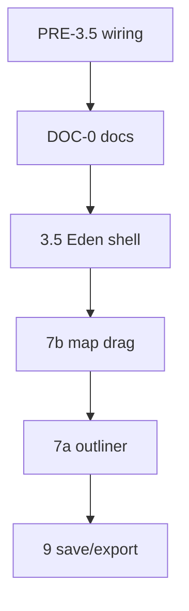

# AGENT EXECUTION CONTRACT

> **For the human:** Open a new Cursor Agent / CLI session and paste the prompt below. The agent reads this file and executes phases in order without re-planning.

## One-line prompt (copy this)

```
Follow Design_Docs/Mission_Creator_Architecture/05_agent_execution_plan.md exactly. Read the Decisions log first. Execute from PHASE PRE-3.5 (or DOC-0 if wiring is done). After each phase run `cd frontend && npm run build && npm run lint`. Do not skip phases. Do not commit unless I ask. Read CLAUDE.md first.
```

Shorter variant:

```
@05_agent_execution_plan.md — execute from PHASE DOC-0, phase by phase, verify build/lint each phase.
```

## Document hierarchy (read in this order — do not mix sources)

| Priority | Document | Agent uses it for |
|----------|----------|-------------------|
| **1** | **This file** (`05_agent_execution_plan.md`) | **Execution authority.** Phases, tasks, acceptance criteria, Decisions log. If anything else conflicts, **this file wins**. |
| **2** | **Decisions log** (below) | Locked human choices. Do not re-litigate. |
| **3** | `04_eden_editor_ux_spec.md` | UX contract — created in PHASE DOC-0; copies Decisions log + interaction table. |
| **4** | `03_engineering_ultra_plan.md` | Engineering ADRs, Y.Doc schema, compiler/export contract, file tree. |
| **5** | `CLAUDE.md` | Repo conventions, run commands, commit tags. |
| **6** | Aegis design tokens | `frontend/src/index.css` + label/spacing scale (`text-label-sm`, `overlayPanel`, etc.). Glass palette only — **not layout**. |

**Do not use for layout or interaction decisions** (historical HTML explorations — they **contradict each other** and the Decisions log):

- `Design_Docs/Mission_Creator_Mock_Up/**/code.html`, `screen.png`
- `Design_Docs/macOS_Blueprints/**/code.html`, `screen.png` (editor-related — see map below)

**Supplementary only** (style tokens / product vision — read when noted, never override this plan):

| Path | Use for |
|------|---------|
| `Mission ccreator/DESIGN.md` | Aegis color tokens, typography scale, **256px / 320px** panel widths |
| `frontend/src/index.css` + `overlay.ts` | Live glass palette, semantic classes |
| `mission_creator_design.md` | Long-term product vision (Forge, Visual-Git, Briefing UI) — **deferred** items |
| `01_technical_specification.md` | *Why* the four hard problems exist (200 slots, DEM, nesting, registry) |
| `03_engineering_ultra_plan.md` | Full engineering phases 0–9, file tree, compiler §8, workers, DEM |

Visual target: **Arma 3 Eden Editor** layout + interactions, **modernized with Aegis glass**. Dimensions: left **256px** (`w-64`), right **320px** (`w-80`), both docked flush; map between them.

| Code | Route |
|------|-------|
| `frontend/src/features/mission-creator/` + `frontend/src/features/tactical-map/` | `/missions/:id/edit` |
| `frontend/src/pages/missions.tsx` | Mission library (entry to editor) |
| `frontend/docs/pages/mission-creator.md` | Setup wizard spec (`/missions/create`) — **separate track** |

**STEP 0:** Done — this file is in the repo. New sessions start at **PHASE PRE-3.5** (or DOC-0 if wiring landed).

---

## Repository documentation map

Every Mission Creator-related folder and its role. **Execution authority remains this file**; other docs provide engineering depth or historical context.

### `Design_Docs/Mission_Creator_Architecture/` — engineering

| File | Role |
|------|------|
| `05_agent_execution_plan.md` | **This file** — phases, decisions, acceptance criteria |
| `03_engineering_ultra_plan.md` | ADRs, full file tree, phases 0–9, Y.Doc schema, compiler JSON §8, workers |
| `01_technical_specification.md` | Problem statement (200-slot DOM, DEM, nesting, registry) |
| `04_eden_editor_ux_spec.md` | *(Create in DOC-0)* — human-readable UX contract copied from Decisions log |

### `Design_Docs/Mission_Creator_Mock_Up/` — product + early UI explorations

| Path | Role |
|------|------|
| `mission_creator_design.md` | Product blueprint: Forge, Loadout Forge, Visual-Git, Briefing UI, JSON sync |
| `Mission ccreator/DESIGN.md` | Aegis tokens + panel dimensions (256 / 320) |
| `Mission ccreator/code.html` + `screen.png` | Historical layout exploration — **do not execute against** |
| `Arsenal/DESIGN.md` | Arsenal / Loadout Forge visual tokens (Phase 5–6) |

### `Design_Docs/macOS_Blueprints/` — editor-adjacent references

| Path | Role |
|------|------|
| `aegis_mission_editor_macos_edition/` | Early editor chrome exploration |
| `mission_editor_tactical_canvas/` | Map canvas styling reference |
| `tbd_mission_creator_visual_git_diffing/` | Future Visual-Git UI (Phase 9+) |
| `loadout_forge_tactical_equipment_management/` | Future Arsenal UI (Phase 6) |

### `frontend/src/features/` — implementation (source code)

| Module | Role |
|--------|------|
| `tactical-map/` | Deck.gl engine, Y.Doc state, layers, coords — **terrain-agnostic** |
| `mission-creator/` | Editor shell: layout panels, hooks, modals |

Key engine files already exist: `TacticalMap.tsx`, `state/{ydoc,schema,bindings,useMapStore,undo}.ts`, `layers/useIconLayer.ts`, `hooks/useMissionDoc.ts`.

Key shell files: `MissionCreatorPage.tsx`, `layout/{TopCommandStrip,BottomToolbelt,OutlinerPanel,AssetBrowser,InspectorPanel,AttributesModal}.tsx`.

**Not yet built** (per Ultra Plan): `dem/*`, `tools/*`, `registry/*`, `compiler/*`, `hooks/useMissionEditor.ts`, most extra layers.

### Other

| Path | Role |
|------|------|
| `CLAUDE.md` (T-029–T-032) | Shipped status snapshot — update in DOC-0 |
| `frontend/docs/pages/mission-creator.md` | `/missions/create` setup wizard (T-003) |
| `frontend/src/stitch-exports/mission_creator_setup_wizard/` | Wizard HTML mock |

---

## Architecture state (what exists today)

```mermaid
flowchart LR
  subgraph done [Shipped T-029 to T-032]
    Deck["Deck.gl viewport"]
    YDoc["Y.Doc + 9 maps"]
    IDB["y-indexeddb"]
    Undo["Y.UndoManager"]
    Icons["IconLayer slots"]
    Shell["Floating glass shell"]
  end
  subgraph wip [In progress uncommitted]
    Layers["editorLayers outliner"]
    DnD["Palette drag to map"]
  end
  subgraph plan [This plan]
    Eden["Eden docked shell 3.5"]
    Drag["Map drag 7b"]
    Tree["Outliner ops 7a"]
    Save["Compiler + API 9"]
  end
  done --> wip --> plan
```



**Data flow (do not break):** mutations → `ydoc.ts` `transact()` → `bindings.ts` → `useMapStore` → Deck layers. Only `selection`, `activeTool`, `activeLayerId` are set directly on Zustand.

**Entity maps in Y.Doc:** `meta`, `factions`, `squads`, `slots`, `loadouts`, `items`, `objectives`, `vehicles`, `markers`, `editorLayers`.

**What works end-to-end today:** open `/missions/:id/edit`, pan/zoom grid, drag mock catalog unit onto map, see in outliner, select/move via click-then-click, undo/redo, local IndexedDB per mission id.

**What does not work yet:** backend save/load, export JSON, real asset catalog, DEM Z-axis, map drag, multi-select, Eden docked layout, fullscreen editor, Arsenal, tools/objectives.

---

## Full phase roadmap

| Phase | Name | Status | Deliverable |
|-------|------|--------|-------------|
| 0–1 | Viewport | **Done** | Deck.gl orthographic map, pan/zoom, procedural grid |
| 4 | State foundation | **Done** | Y.Doc, Zustand mirror, undo, IconLayer, y-indexeddb |
| 3a | Shell scaffold | **Done** | Floating panels, TreeView, modals (T-031/032) |
| PRE-3.5 | Land tree wiring | **Next** | Verify/commit editorLayers + palette DnD baseline |
| DOC-0 | Doc alignment | Pending | `04_eden_editor_ux_spec.md` + patch ultra plan, CLAUDE, design |
| **3.5** | **Eden shell** | Pending | Fullscreen, docked sidebars, palette tabs, modal inspector |
| **7b** | **Map manipulation** | Pending | Drag-move, marquee, Spacebar, Delete |
| **7a** | **Outliner ops** | Pending | Reparent, rename, delete folders/slots |
| **9** | **Compiler + save** | Pending | `json_payload` export, draft autosave, Save Version |
| 2 | DEM / Z-axis | Blocked | Heightmap assets |
| 5–6 | Registry + Arsenal | Blocked | `GET /api/v1/registry` |
| 8 | Tools + objectives | Blocked | Ruler, zones, LoS GLSL |
| T-003 | Setup wizard | Separate | `/missions/create` → POST mission → open editor |



---

## Current gaps (Eden target vs code today)

| Eden / Decisions log | Current code | Fixed in |
|---------------------|--------------|----------|
| Fullscreen editor (no platform nav) | `Sidebar` + `TopNav` still visible | Phase 3.5 |
| Docked L/R panels, map between | Floating `inset-x-4` panels | Phase 3.5 |
| Asset palette always visible | Right panel swaps to `SlotInspector` | Phase 3.5 |
| ORBAT + Editor Layers sections | Workflow folders only | Phase 3.5 |
| Attributes modal on double-click | Modal stub; fields in SlotInspector | Phase 3.5 |
| Eden time slider/scrub | Hidden in MissionSettingsDialog | Phase 3.5 |
| Topo map + grid overlay | Procedural line grid only | Phase 3.5 |
| Click-drag icons to move | Click entity, click map to teleport | Phase 7b |
| Marquee multi-select | Single `selection.id` | Phase 7b |
| Spacebar to center | Auto `flyTo` on outliner click | Phase 3.5 + 7b |
| Delete key | No keyboard delete | Phase 7b |
| Export + API autosave | Export disabled; IndexedDB only | Phase 9 |

---

## Interaction contract

| User action | System response |
|-------------|-----------------|
| Drag asset from palette | Place entity on map; file in active Editor Layer |
| Single-click entity | Select + highlight + outliner sync (**no** camera move) |
| Double-click entity | Open **AttributesModal** (Transform, Identity, States, Arsenal tabs) |
| Click-drag entity on map | Move entity; one undo step on release |
| Left-drag on empty map | Marquee box-select |
| Middle-mouse / right-drag | Pan/zoom map |
| Click-drag selected group | Move all selected together; one undo step |
| Spacebar | Center camera on selection |
| Delete / Backspace | Delete selected entities (undoable) |
| Click empty map | Clear selection only |
| Click outliner row | Select entity (**no** camera move until Spacebar) |

---

## Decisions log (human-confirmed — agent must follow)

These resolve ambiguities from earlier drafts. **Do not re-litigate without user approval.**

| Topic | Decision |
|-------|----------|
| **Visual target** | **Arma 3 Eden Editor** layout + interactions, **modernized with Aegis glass** (macOS). Not HTML mockups. |
| **Platform chrome** | **Hide** platform `Sidebar` + `TopNav` on `/missions/:id/edit` — true fullscreen Eden-style editor (dedicated layout escape in `AppLayout` or editor wrapper). |
| **Left sidebar** | **Both sections visible** in one scroll: **ORBAT** (Factions→Squads→Slots) on top, **Editor Layers** (workflow folders) below. Stub sections for Waypoints/Zones/Logic until Phase 8. |
| **Right palette** | **Docked flush right** — mirror left sidebar (~`w-80` / 320px), full height below top bar, no floating gap. Map sits between two glass panels. |
| **Inspector** | Asset Palette always visible. **Attributes modal on double-click only** (no right-panel inspector swap). |
| **Map pan** | **Middle-mouse or right-drag** = pan/zoom. **Left-drag on empty map** = marquee box-select. |
| **Multi-select** | **Marquee box** is the primary multi-select method. Shift+click additive toggle is optional bonus, not required for v1. |
| **Center camera** | **No auto flyTo on click.** Select unit → press **Spacebar** to center camera on selection (map or outliner). |
| **Delete** | **Delete/Backspace** removes selected entities; **undoable** (one transaction). No confirmation dialog. |
| **Load conflict** | When API `json_payload` and local IndexedDB disagree → **prompt user** to choose which to keep. |
| **Autosave** | **Debounced autosave** overwrites a single server **draft** on the mission. **Undo** = in-session. Manual **Save Version** creates semver snapshots for future Visual-Git/history. |
| **Time of day** | Match **Arma 3 Eden** environment control (slider/scrub in environment UI — not preset-only dropdowns). Expose quick readout in top bar; fine control in Mission Settings. |
| **Phase order** | **Commit/finish uncommitted tree wiring FIRST** (pre-3.5), then DOC-0 → 3.5 → 7b → 7a → 9. |

---

## Agent rules (mandatory)

1. **Read first:** `CLAUDE.md` (conventions), then this file, then `03_engineering_ultra_plan.md` §0–§2.
2. **Phase order is strict:** PRE-3.5 wiring commit → DOC-0 → 3.5 → 7b → 7a → 9. Never start a later phase until the current phase's acceptance criteria pass.
3. **Verify gate** after every phase:
   ```bash
   cd frontend && npm run build && npm run lint
   ```
4. **Do not commit** unless the user explicitly asks.
5. **Do not** start Phases 2, 5, 6, or 8 without user approval (external blockers).
6. **Visual target:** Arma 3 Eden Editor + Aegis tokens. **Never** derive layout from `code.html` / `screen.png` mockups — use Decisions log + this plan only.
7. **State rule:** Entity mutations go through `tactical-map/state/ydoc.ts` → `bindings.ts` → `useMapStore`. Never set entity data directly on Zustand.
8. **Inspector rule:** Asset Palette stays on the right always. Properties edit via **AttributesModal on double-click only** — no right-panel inspector swap.
9. **Move rule:** Click-drag icons on the map to move (Phase 7b). Remove click-empty-map-to-teleport. Marquee box-select on left-drag empty map; middle-mouse/right-drag pans.
10. **Camera rule:** Spacebar centers on current selection. No automatic flyTo on single-click (map or outliner).
11. **Delete rule:** Delete/Backspace removes selected entities in one undoable transaction.
12. **Fullscreen rule:** Hide platform Sidebar + TopNav on the editor route.

---

## Execution checklist (do in order)

### STEP 0 — Publish plan ✓
- [x] `Design_Docs/Mission_Creator_Architecture/05_agent_execution_plan.md` is in the repo

### PHASE PRE-3.5 — Land uncommitted tree wiring
**Goal:** Commit stable baseline before layout overhaul.

**Tasks:**
1. Review and commit current uncommitted work: `editorLayers`, outliner bound to Y.Doc, asset drag→map, `placedEntitiesMock` deleted
2. Ensure `npm run build && npm run lint` pass
3. **Do not commit** unless user explicitly asks — stage and report; user may say "commit with T-033"

**Done when:** Tree wiring is clean and build-verified; ready for layout refactor.

---

### PHASE DOC-0 — Documentation alignment
**Goal:** Docs agree on Eden layout + interactions before more code.

**Tasks:**
1. Create `04_eden_editor_ux_spec.md` — copy **Decisions log**, **Interaction contract**, layout diagram from this file
2. Update `03_engineering_ultra_plan.md`: docked shell, fullscreen, phases PRE-3.5/3.5/7b/7a, `EditorLayer`, multi-select `Selection`, point UX authority to this file
3. Update `mission_creator_design.md` §1: Attributes dialog; palette always visible; note HTML mockups are historical
4. Update `CLAUDE.md`: T-033, current phase status, uncommitted wiring note
5. Document `AppLayout` fullscreen escape for editor route

**Done when:** All four files updated; no code changes required.

---

### PHASE 3.5 — Eden shell fidelity
**Goal:** Editor shell matches **Arma 3 Eden layout** (Aegis glass skin). Includes fullscreen chrome + Spacebar camera.

**Layout target:**
```
┌─────────────────────────────────────────────────────────────┐
│ TopCommandStrip (h-12) — NO platform TopNav/Sidebar          │
├──────────┬──────────────────────────────────────┬───────────┤
│ Left     │         TacticalMap                  │ Right     │
│ w-64     │         ml-64 mr-80                  │ w-80      │
│ ORBAT +  │         topo + grid overlay          │ Asset     │
│ Layers   │         [BottomToolbelt in map area] │ Palette   │
└──────────┴──────────────────────────────────────┴───────────┘
```

**Key files:** `MissionCreatorPage.tsx`, `AppLayout.tsx` or editor wrapper, `TopCommandStrip.tsx`, `LeftOutliner/` (→ `LeftSidebar.tsx`), `RightInspector/AssetBrowser.tsx`, `AttributesModal.tsx`, `overlay.ts`, `BottomToolbelt.tsx`, `router.tsx` (fullscreen handle)

**Tasks:**
0. **Fullscreen:** Hide platform `Sidebar` + `TopNav` on `/missions/:id/edit`
1. **Layout:** Docked left `w-64` + right `w-80` flush; map `ml-64 mr-80`; top bar full width
2. **Top bar:** Mission title (inline edit); menu stubs (File/Edit/View/Mission/Environment); **Eden time slider/scrub** + weather wired to `updateEnvironment`; undo/redo; Export (still disabled until Phase 9); settings gear → `MissionSettingsDialog` (view distance, thermals)
3. **Left sidebar — both sections in one scroll:**
   - **ORBAT** (top): `factions` → `squads` → `slots` (export truth; read-only OK if no ORBAT UI yet)
   - **Editor Layers** (below): `editorLayers` workflow folders (current outliner)
   - **Stubs:** Waypoints, Zones, Logic & Events (empty until Phase 8)
   - **Bottom icon tabs:** Hierarchy, Layers, Assets, History, Settings (stubs switch content later)
   - Header: OUTLINER + mission name + New folder
4. **Right asset palette (always visible):**
   - Tabs: Factions | Vehicles | Markers | Objectives
   - Pattern: 2-col **grid cards** at tab top level → drill-down **tree** (Men → Rifleman)
   - Keep `ASSET_DND_MIME` drag onto map; mock data OK until registry API
   - Remove `InspectorPanel` → `SlotInspector` swap entirely
5. **AttributesModal** (double-click only) — migrate `SlotInspector` fields:
   - **Transform:** X/Y/Z, rotation (Z read-only until DEM)
   - **Identity:** role, tag, callsign, squad
   - **States:** medic/engineer flags (stub)
   - **Arsenal:** Open Loadout Forge button (stub until Phase 6)
6. **Map skin:** Topo placeholder under Deck.gl + procedural grid at low opacity
7. **Spacebar** → `flyTo` selection centroid; remove auto `flyTo` on outliner click
8. **TreeView polish:** `border-l-2 border-primary` on selected row; folder open/closed icons

**Acceptance:** All boxes under **Phase 3.5 — Eden shell** in [Acceptance criteria](#acceptance-criteria) below.

**Verify:** `npm run build && npm run lint`

---

### PHASE 7b — Map drag & multi-select
**Goal:** Eden manipulation — grab icons on the map; marquee select; group move.

**Problem today:** `MissionCreatorPage` `onMapClick` → `moveEntity` requires click-then-click. Selection is single `{ kind, id }`.

**Key files:** `TacticalMap.tsx`, `tools/useSelectTool.ts` (create), `layers/useIconLayer.ts`, `layers/useSelectionLayer.ts` (create), `state/schema.ts`, `state/useMapStore.ts`, `state/ydoc.ts`, `state/selectors.ts`, `MissionCreatorPage.tsx`

**Tasks:**
1. **Schema:** `Selection` → `{ kind, ids: ID[] }`; update store, selectors, icon highlights, outliner multi-highlight
2. **Drag-move:** pointer down on icon → transient preview (do **not** write Y.Doc every frame); pointer up → one `transact()` / one undo step
3. **`moveEntities(md, ids, delta)`** in `ydoc.ts` — atomic group move
4. **Marquee:** left-drag on empty map draws selection box (`useSelectionLayer`); middle-mouse / right-drag pans
5. **Controller:** disable Deck pan while dragging entities; disable left-drag pan (marquee replaces it)
6. Remove `onMapClick` teleport path entirely
7. **Delete/Backspace** → batch `removeEntity`, undoable
8. **Spacebar** → `flyTo` centroid of `selection.ids`

**AttributesModal rule:** double-click opens modal only when **one** entity selected; multi-select shows count or disables modal.

**Acceptance:** All boxes under **Phase 7b — Map manipulation** in [Acceptance criteria](#acceptance-criteria) below.

**Verify:** `npm run build && npm run lint`

---

### PHASE 7a — Outliner tree operations
**Goal:** Eden left-tree workflow — reparent, rename, delete.

**Key files:** `OutlinerPanel.tsx` / `LeftSidebar.tsx`, `TreeView.tsx`, `ydoc.ts` (add rename/delete layer actions if missing)

**Tasks:**
1. Outliner reparent DnD between `editorLayers` folders
2. Folder rename + delete UI
3. Delete slot from outliner (wire `removeEntity`)
4. Wire `assetId` from palette payload into slot metadata

**Verify:** `npm run build && npm run lint`

---

### PHASE 9 — Compiler + persistence
**Goal:** Export `json_payload` and autosave to backend.

**JSON contract (Ultra Plan §8 — non-negotiable):** Output must be a **superset** containing existing `orbat[]` shape for `parseOrbatTemplate` in `internal/handlers/events.go`, plus `map`, `environment`, `loadouts`, `objectives`, `vehicles`, `markers`, `schemaVersion`. Separate camelCase export via `exportSchema.ts` for Arma mod.

**API (already exists):** `POST /api/v1/missions/:id/versions` (draft autosave / Save Version), `GET .../versions/:vid` (hydrate). On IndexedDB vs API conflict → **user prompt**.

**Key files:** `compiler/compile.ts`, `compiler/exportSchema.ts`, `compiler/compiler.worker.ts`, `hooks/useMissionEditor.ts`, `TopCommandStrip.tsx`

**Tasks:**
1. `compile.ts` traverses normalized state → `orbat[]` superset
2. Enable Export → download JSON
3. `useMissionEditor`: hydrate on load; debounced draft autosave; manual Save Version → new semver
4. Unsaved-changes indicator
5. Visual-Git scrubber stub in top bar (full UI deferred)

**Verify:** `npm run build && npm run lint` + dev-login smoke on `/missions/:id/edit`

---

### DEFERRED — Do not start without user approval

| Phase | Blocker / notes |
|-------|-----------------|
| 2 DEM / Z-axis | Hosted 16-bit heightmaps + topo tiles; `dem/*`, `useDemLayer.ts` |
| 5–6 Registry + Arsenal | `GET /api/v1/registry`; `registry.worker.ts`, `ArsenalInspector`, paper-doll |
| 8 Tools + objectives | Ruler, LoS GLSL, zones, `useLineLayer`, `usePolygonLayer`; needs DEM for LoS |
| T-003 Setup wizard | `/missions/create` → `POST /missions` → navigate to editor |
| Product (future) | Visual-Git diff ghosts, Mission Planner, in-game Briefing UI, multiplayer y-websocket — see `mission_creator_design.md` |

---

## Do not break (preserve these)

- **Deck.gl + Y.Doc architecture** — Eden is a shell on top; never per-entity DOM on the map
- **Y.Doc mutation path** — `ydoc.ts` `transact()` only; one user gesture = one undo step
- **Palette → map placement** — `ASSET_DND_MIME` + `addSlot` flow
- **`editorLayers`** — workflow folders; export uses factions/squads/slots not layers
- **Undo/redo** — `Y.UndoManager` with `LOCAL_ORIGIN`
- **Lazy route** — `/missions/:id/edit` code-split; `mission_maker+` gate
- **IndexedDB** — local durability via `useMissionDoc` even after API lands

---

## Acceptance criteria

### Phase 3.5 — Eden shell

- [ ] Left sidebar docked flush left (`w-64`); right palette docked flush right (`w-80`); map between them
- [ ] **No** platform Sidebar/TopNav on `/missions/:id/edit`
- [ ] Right Asset Palette always visible with tabs (Factions / Vehicles / Markers / Objectives)
- [ ] Double-click opens Attributes modal with editable fields (role, tag, stance at minimum)
- [ ] Time control matches Eden (slider/scrub — not preset-only dropdowns)
- [ ] Map has topo appearance (placeholder OK) + grid overlay
- [ ] Left panel shows **both** ORBAT section and Editor Layers section
- [ ] Spacebar centers on selection (no auto-center on click)
- [ ] Bottom toolbelt shows X/Y/Z in mono, centered in map area

### Phase 7b — Map manipulation

- [ ] Click-drag a placed unit to move it (no second click on the map)
- [ ] Marquee box-select on left-drag empty map
- [ ] Middle-mouse / right-drag pans the map
- [ ] Spacebar centers camera on selection
- [ ] Delete removes selection; undo restores
- [ ] Group move is a single undo step
- [ ] Clicking empty map only deselects

---

## How to run this plan

1. Start a new Agent session in this repo.
2. Paste the [one-line prompt](#one-line-prompt-copy-this) from the top of this file.
3. Start at **PHASE PRE-3.5** (or **DOC-0** if wiring is already landed).
4. To resume: `Continue 05_agent_execution_plan.md from PHASE 7b` (or next incomplete phase).
5. To commit after a phase passes verification: `commit with tag T-033`.

**Agent reminder:** Read **Document hierarchy** → **Decisions log** → **Architecture state** before code. Use **Interaction contract** for behavior. Ultra Plan §8 for compiler. HTML mockups are historical only.
