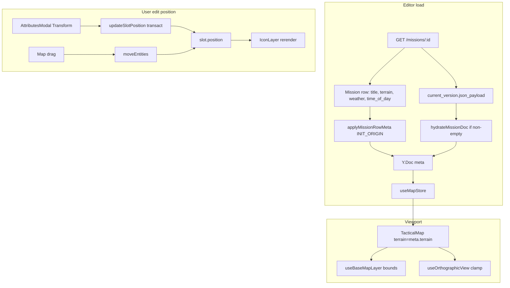

# T-049 — Terrain, title hydrate, numeric position

**Status:** shipped (T-049)  
**Git tag on ship:** T-049  
**Authority:** [MC ROADMAP](ROADMAP.md) · [eden/gap_analysis.md](eden/gap_analysis.md) (`MAP-TERRAIN-001`, `TOP-TITLE-001`, `DATA-HYD-TITLE-001`, `ATTR-FIELD-OBJ-POSITION`) · [engineering_plan.md](engineering_plan.md) §2

---

## Goal

Ship the **code-only** flat-grid slice — no map tiles (**T-090**), no DEM (**T-091**), no registry (**T-068**):

| ID | FEDS ID | Deliverable |
|----|---------|-------------|
| **MAP-TERRAIN-001** | `MAP-TERRAIN-001` | Wire `meta.terrain` → `<TacticalMap>` viewport (Everon / Arland bounds) |
| **TOP-TITLE-001** | `TOP-TITLE-001` / `DATA-HYD-TITLE-001` | Hydrate mission row `title` into `meta.title` on editor load |
| **ATTR-FIELD-OBJ-POSITION** | `ATTR-FIELD-OBJ-POSITION` | Editable **X, Y, Z, rotation** on Transform tab; map icon stays in sync |

**Out of scope for T-049:** T-068 registry, T-069 markers, T-070 vehicles, T-071 ORBAT authoring, DEM sampling, map imagery, `PATCH` title sync, multi-selection transform, toolbelt-driven editing.

---

## Locked decisions (user confirmed)

| Decision | Choice |
|----------|--------|
| Position fields | **X + Y + Z + rotation** all editable (manual Z; no DEM) |
| Title ↔ PostgreSQL | **Hydrate on load only** — strip edits live in Y.Doc; no `PATCH /missions/:id` in T-049 (see rationale below) |
| Toolbelt coords | **Selection-aware** — when exactly **one slot** selected, show entity X/Y/Z; otherwise show **cursor** X/Y. _(Superseded by **T-050**: CUR mode now shows cursor X/Y/**Z** with Z=0 on the flat map.)_ |
| Build order | **MAP-TERRAIN-001 → TOP-TITLE-001 → ATTR-FIELD-OBJ-POSITION** (terrain first — unblocks Arland missions) |
| State rule | All entity/meta mutations via `ydoc.ts` `transact()` / `INIT_ORIGIN` for hydrate |
| Inspector rule | Attributes modal on dbl-click only — unchanged |

### Rationale — title hydrate only

- Editor autosave is **local IndexedDB**; versions API stores `json_payload`, not mission row metadata.
- `PATCH /missions/:id` exists (`UpdateMission`) but wiring debounced title sync is a separate product decision (risk: row vs Y.Doc drift).
- **T-049:** `GET` row → `meta.title`; user can still edit in top strip; **Save Version** compiles payload only (title in export via `exportSchema` from meta).
- **Future T-051 (optional):** `PATCH` title on Save Version or debounced strip edit. _(T-050 was used for the cursor Z readout — see [`t050_cursor_z_readout.md`](t050_cursor_z_readout.md).)_

---

## Root cause audit (why it's broken today)

### MAP-TERRAIN-001 — Terrain

```89:90:frontend/src/features/mission-creator/MissionCreatorPage.tsx
// TODAY: hardcoded — ignores meta.terrain and mission row
<TacticalMap terrain="everon" ... />
```

- `useMapStore.meta.terrain` is populated from Y.Doc (`bindings.ts`) but **never passed** to the map.
- Fresh missions: `POST /missions` stores `terrain` on DB row; initial `json_payload` is `{}` → `hydrateMissionDoc` never sets terrain → local meta stays `everon` from `seedMeta`.
- `getTerrain()` + `useBaseMapLayer` + `useOrthographicView` already resize/clamp from `TerrainDef` — they just need the correct prop.

### TOP-TITLE-001 — Title

```56:70:frontend/src/features/mission-creator/hooks/useMissionEditor.ts
// TODAY: fetches mission but ignores res.data.title; bails on empty payload
const payload = version?.json_payload
if (!payload) return // ← BUG for new missions: skips row hydrate
```

```57:58:frontend/src/features/mission-creator/hooks/useMissionDoc.ts
seedMeta(md, { id: missionId ?? 'draft', title: 'Untitled Mission' })
```

- Create dialog sends `title` → DB row; editor always shows **Untitled Mission** until user retypes.

### ATTR-FIELD-OBJ-POSITION — Position

```83:103:frontend/src/features/mission-creator/layout/AttributesModal.tsx
// TODAY: ReadonlyField for X/Y/Z/rotation; stale help text says drag is "coming later"
```

- Map drag via `moveEntities` **works** (Phase 7b).
- No `setPosition` / `updateSlotPosition`; `updateSlot` excludes position.
- `TextField type="number"` exists in `fields.tsx` — reuse with `font-mono` for coords (Aegis R3).

---

## Target architecture



---

## Implementation specification

### 1. Y.Doc — `applyMissionRowMeta` (new)

**File:** [`frontend/src/features/tactical-map/state/ydoc.ts`](../../frontend/src/features/tactical-map/state/ydoc.ts)

```typescript
/** Apply mission row fields from GET /missions/:id (INIT_ORIGIN — not undo, not dirty). */
export function applyMissionRowMeta(
  md: MissionDoc,
  row: {
    title: string
    terrain: string
    time_of_day?: string
    weather?: string
  },
): void
```

**Behavior:**

- Use `md.doc.transact(..., INIT_ORIGIN)` (same as `seedMeta`).
- Set `meta.title` from `row.title` when non-empty.
- Set `meta.terrain` when `row.terrain` is valid `TerrainId` (`everon` | `arland` | `custom`); ignore invalid.
- Merge `meta.environment.time` ← `row.time_of_day`, `meta.environment.weather` ← `row.weather` when present; preserve `viewDistance` / `thermals` defaults.
- Export from [`frontend/src/features/tactical-map/index.ts`](../../frontend/src/features/tactical-map/index.ts).

### 2. Y.Doc — `updateSlotPosition` (new)

**File:** same `ydoc.ts`

```typescript
export function updateSlotPosition(
  md: MissionDoc,
  id: ID,
  patch: Partial<{ x: number; y: number; z: number; rotation: number }>,
): void
```

**Behavior:**

- `transact(md, ...)` — one undo step per call site (commit on blur/Enter, not every keystroke).
- Merge into existing `slot.position` object; preserve untouched axes.
- **Clamp** x/y to `[0, terrain.width]` / `[0, terrain.height]` using `getTerrain(md.meta.get('terrain'))`.
- Z: allow any finite number (manual entry; default 0 for new slots unchanged).
- Rotation: degrees; allow 0–360 or normalize with `% 360` on commit (pick one; document in code).

### 3. `useMissionEditor.ts` — fix load path

**File:** [`frontend/src/features/mission-creator/hooks/useMissionEditor.ts`](../../frontend/src/features/mission-creator/hooks/useMissionEditor.ts)

Replace `onSynced` body:

1. `GET /missions/:id` → typed `MissionDetail`.
2. Read `current_version.semver` + `json_payload`.
3. Build row meta from `res.data` (`title`, `terrain`, `time_of_day`, `weather`).
4. **If `json_payload` missing or `{}`:**
   - `applyMissionRowMeta(md, row)` — **fixes new missions**
   - return (no conflict)
5. **If payload non-empty:**
   - If `hasLocalContent(md)` → `setConflict(payload)` (unchanged)
   - Else → `hydrateMissionDoc(md, payload)` then `applyMissionRowMeta(md, row)` (row title wins if payload lacks title in meta — today compile omits title from payload)

**Conflict resolve:** when user picks **server**, after `hydrateMissionDoc` also call `applyMissionRowMeta` from a cached row snapshot OR re-fetch GET — simplest: store `lastRowMeta` ref from initial GET and re-apply on server choice.

### 4. TypeScript API contract

**File:** [`frontend/src/types/api/index.ts`](../../frontend/src/types/api/index.ts)

```typescript
export interface MissionDetail extends MissionCard {
  armory: MissionArmory[]
  current_version?: {
    id: string
    semver: string
    json_payload?: Record<string, unknown>
  } | null
}
```

Matches backend `GET /missions/:id` (GORM preloads version + payload).

### 5. MAP-TERRAIN-001 — Wire terrain to map

**File:** [`frontend/src/features/mission-creator/MissionCreatorPage.tsx`](../../frontend/src/features/mission-creator/MissionCreatorPage.tsx)

```tsx
const terrainId = useMapStore((s) => s.meta?.terrain ?? 'everon')

<TacticalMap
  key={terrainId}
  terrain={terrainId}
  ...
/>
```

- `key={terrainId}` forces viewport remount when terrain changes (Arland 10240 vs Everon 12800).
- Validate `terrainId` is `TerrainId`; fallback `everon`.

**File:** [`layout/MissionSettingsDialog.tsx`](../../frontend/src/features/mission-creator/layout/MissionSettingsDialog.tsx) — read-only terrain display already uses meta; verify it reads store after hydrate.

### 6. TOP-TITLE-001 — Title (no new UI)

**Files:** Top strip already works via `setTitle`.

- [`TopCommandStrip.tsx`](../../frontend/src/features/mission-creator/layout/TopCommandStrip.tsx) — no change if hydrate works.
- [`LeftSidebar.tsx`](../../frontend/src/features/mission-creator/layout/LeftOutliner/LeftSidebar.tsx) — verify title display reads `meta.title`.

**Acceptance:** Create mission "Op Iron Curtain" → editor top strip shows that title, not Untitled.

### 7. ATTR-FIELD-OBJ-POSITION — Attributes Transform tab

**File:** [`frontend/src/features/mission-creator/layout/AttributesModal.tsx`](../../frontend/src/features/mission-creator/layout/AttributesModal.tsx)

Replace `TransformTab` read-only fields with:

| Field | Control | Commit |
|-------|---------|--------|
| X, Y, Z | `TextField type="number"` + `font-mono` / mono class | `onBlur` + Enter → parse float → `updateSlotPosition` |
| Rotation | same | same |
| Stance | existing `SelectField` | unchanged |

- Remove stale copy: *"Drag the unit on the map to reposition it (coming in a later phase)"* → *"Drag on the map or edit coordinates below. Z is manual until terrain elevation (DEM) ships."*
- Invalid input: ignore or toast once; do not write NaN.
- Single slot only (modal already single-entity).

**Optional:** Add `NumberField` helper in `fields.tsx` with mono styling + blur commit pattern.

### 8. Toolbelt — selection-aware readout

**File:** [`frontend/src/features/mission-creator/layout/BottomToolbelt.tsx`](../../frontend/src/features/mission-creator/layout/BottomToolbelt.tsx)

**File:** [`MissionCreatorPage.tsx`](../../frontend/src/features/mission-creator/MissionCreatorPage.tsx) — pass selection or compute inside toolbelt from store.

Logic:

```
if selection.kind === 'slot' && selection.ids.length === 1:
  read slotsById[id].position → show X/Y/Z (mono)
else:
  show cursorWorld X/Y; Z = —
```

Label subtly: **"Selection"** vs **"Cursor"** (optional small prefix) so users know which readout is active.

**Do not** make toolbelt fields editable in T-049 — readout only (edit in Attributes).

---

## Files to change (checklist)

| File | Change |
|------|--------|
| `frontend/src/features/tactical-map/state/ydoc.ts` | `applyMissionRowMeta`, `updateSlotPosition` |
| `frontend/src/features/tactical-map/index.ts` | export new functions |
| `frontend/src/features/mission-creator/hooks/useMissionEditor.ts` | fix `onSynced`, conflict row re-apply |
| `frontend/src/types/api/index.ts` | `MissionDetail.current_version.json_payload` |
| `frontend/src/features/mission-creator/MissionCreatorPage.tsx` | dynamic `terrain` + `key` |
| `frontend/src/features/mission-creator/layout/AttributesModal.tsx` | editable Transform |
| `frontend/src/features/mission-creator/layout/BottomToolbelt.tsx` | selection readout |
| `frontend/src/features/mission-creator/layout/RightInspector/fields.tsx` | optional mono number field |

**No backend changes** (API already returns row + payload).

---

## Verification

```bash
cd frontend && npm run build && npm run lint
```

### Manual test plan

**MAP-TERRAIN-001 terrain**

1. Create mission with **Arland** in Library dialog → open editor → grid bounds **10240×10240** (smaller than Everon); pan clamp matches.
2. Create with **Everon** → 12800×12800 grid.
3. Existing saved mission with `json_payload.map.terrain: "arland"` hydrates correctly.

**TOP-TITLE-001 title**

4. Create mission titled **"Test Op Alpha"** → editor strip + left sidebar show that title.
5. Reload page → title persists from API/IndexedDB reconcile.
6. Edit title in strip → still works; refresh → shows edited local title (IndexedDB) until conflict/server load.

**ATTR-FIELD-OBJ-POSITION position**

7. Place a slot → open Attributes Transform → change X/Y → icon moves on map.
8. Change Z to `50` → persists in modal and toolbelt selection readout.
9. Change rotation → icon rotation updates (if IconLayer uses rotation — verify; if not rendered yet, value still saves and export compiles).
10. Map drag → Transform tab values update live.
11. Undo reverts numeric edit (one step per blur commit).
12. Multi-select → Attributes dbl-click single only; toolbelt shows cursor not selection when 0 or 2+ selected.

**Regression**

13. Save Version + Export still work.
14. Conflict dialog still works when local has slots + server has payload.
15. Spacebar center, Delete, marquee — unchanged.

---

## Documentation sync (same commit — T-049)

Use [`docs/AGENT_COMMIT_CHECKLIST.md`](../../docs/AGENT_COMMIT_CHECKLIST.md).

| Doc | Change |
|-----|--------|
| [`frontend/docs/pages/mission-editor.md`](../../frontend/docs/pages/mission-editor.md) | Transform editable; terrain wired; toolbelt selection readout |
| [`Design_Docs/.../feature_inventory.md`](feature_inventory.md) | Update TOP-TITLE-001, MAP-TERRAIN-001, ATTR-FIELD-OBJ-POSITION rows |
| [`eden/gap_analysis.md`](eden/gap_analysis.md) | Mark MAP-TERRAIN-001 / TOP-TITLE-001 / ATTR-FIELD-OBJ-POSITION **partial→match** where appropriate |
| [`ROADMAP.md`](ROADMAP.md) | Phase 1 row → ✅ T-049; add DONE T-049 section |
| [`docs/frontend/ROADMAP.md`](../../docs/frontend/ROADMAP.md) | mission-editor notes |
| [`CLAUDE.md`](../../CLAUDE.md) §Status | T-049 bullet |
| **This file** | Status → **shipped** |

**Decisions log:** only if UX lock needed — optional one row: *"Numeric transform = Attributes modal; toolbelt = readout only."*

**Do not update:** archive stitch, Eden wiki artifacts.

---

## Git strategy

**One T-049 commit** on `main`: code + doc finalize + CLAUDE §Status. Co-Authored-By when using AI.

If T-048 is still uncommitted, **commit T-048 first**, then T-049 — do not mix tags.

---

## Claude Code handoff prompt

```
Read CLAUDE.md and docs/AGENT_COMMIT_CHECKLIST.md first.

Implement T-049 per Design_Docs/Mission_Creator_Architecture/t049_terrain_title_position.md.

LOCKED:
- MAP-TERRAIN-001: meta.terrain → TacticalMap (key={terrainId}); fix onSynced for empty json_payload
- TOP-TITLE-001: applyMissionRowMeta — title/terrain/env from GET row (hydrate only, no PATCH)
- ATTR-FIELD-OBJ-POSITION: updateSlotPosition — editable X/Y/Z/rotation in AttributesModal Transform; clamp x/y to terrain bounds
- Toolbelt: show selected slot X/Y/Z when exactly one slot selected; else cursor X/Y
- Build order: terrain → title path → transform UI
- All writes through ydoc.ts transact / INIT_ORIGIN for hydrate

KEY BUG TO FIX: useMissionEditor onSynced returns early when json_payload is {} — must still applyMissionRowMeta from mission row.

Verify: npm run build && npm run lint + manual test plan in spec.
Commit on main as T-049 with Co-Authored-By when I ask. Do not commit until I say.
```

---

## Related

- Prior UX: [t048_library_create_dialog.md](t048_library_create_dialog.md)
- Eden backlog (deferred): [`eden/gap_analysis.md`](eden/gap_analysis.md) ticket column → T-068+
- **T-090** / **T-091** map tiles + DEM — blocked on hosted assets
