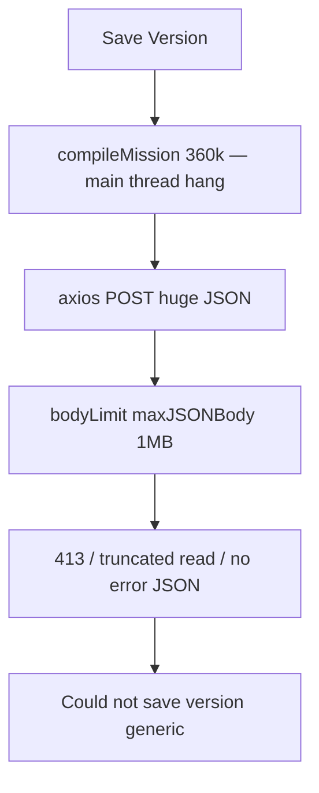

# T-060 — Fast load + save at scale (hydrate gate + progress UX + API body limit)

**Status:** planned (T-060 — next slice)
**Git tag on ship:** T-060
**Authority:** [MC ROADMAP](ROADMAP.md) §Map performance · [agent_execution.md](agent_execution.md) §ACTIVE SLICE

**Prerequisites:** **T-057–T-059** shipped. **Validated (2026-06):** **360k objects @ 100+ fps** pan; repeat **6k paste** smooth.

**Active blockers:**

| # | Blocker | Symptom (observed @ 360k) |
|---|---------|---------------------------|
| 1 | **Load** — no gate/coalesce | Editor open **slow**; **no loading bar**; shell looks frozen |
| 2 | **Save compile** — sync main thread | UI **hangs** on Save Version while `compileMission` runs |
| 3 | **API body limit 1 MB** | After hang → generic **"Could not save version"** — payload never accepted |

**Blocker 3 (confirmed in code):** [`cmd/api/main.go`](../../../cmd/api/main.go) sets `maxJSONBody = 1 << 20` (**1 MB**) on **all** JSON routes via `bodyLimit()` middleware. A **360k-slot** compiled payload is **tens–hundreds of MB**. PostgreSQL `jsonb` has no practical 1 MB limit — the **HTTP middleware** rejects the request before `CreateVersion` runs. Frontend fallback hides the real error (`useMissionEditor.ts` → `"Could not save version"` when `response.data.error` is missing).

---

## Goal

Make **load** and **Save Version** work at scale: visible **progress bars**, faster boot/save path, and **server accepts large mission version payloads** (path to **1M** objects).

**North-star targets (ideal):**

| Operation | Entity scale | Target |
|-----------|--------------|--------|
| **Open editor** | **1M** slots | **≤10 s** + progress bar |
| **Save Version** | **1M** slots | **≤10 s** + progress bar; **POST succeeds** (not 1 MB capped) |

---

## Acceptance (T-060 — minimum ship)

### Backend — mission version body limit (required for save @ scale)

- **`POST /api/v1/missions/:id/versions`** accepts compiled payloads **>> 1 MB** (see locked limit below).
- Other JSON routes **keep** the **1 MB** default (DoS protection unchanged).
- When payload exceeds the mission-version cap: **413** with JSON `{"error": "payload too large (max … MB)"}` — not a silent connection error.
- `CreateVersion` unchanged contract: `{ semver, payload, editor_notes }` → `201` + version row; `409` duplicate semver.
- `make test-it` still passes; add/adjust integration test for raised limit on version route (small payload smoke; optional comment documenting scale limit).

### Frontend — load

- **10k+** slots: **loading overlay + progress bar** on first paint.
- **bindings** coalesces IndexedDB replay → **one** `docToSnapshot` flush.
- `hydrateMissionDoc` wrapped in bulk coalesce.
- Optional: defer `LeftSidebar` until `docReady`.
- Pan **≥55 fps** after load (regression).

### Frontend — save

- **Save Version** progress bar: `Compiling…` → `Uploading…`.
- Chunked/yielding compile at **50k+** (tab stays responsive).
- **Surface API errors:** 413 body-too-large, 409 semver, backend `error` string — never generic-only when server sent a message.
- **360k Save Version** → **201** (with raised API limit + compile completing).

### Engineering

- `cd frontend && npm run build && npm run lint` clean.
- Go API builds; `make test-it` if DB available.

**Stretch:** **360k** load **≤5 s**; **1M** **≤10 s** (may need T-062/T-066 worker compile).

---

## Root cause — save (full chain)



Evidence:
- [`cmd/api/main.go`](../../../cmd/api/main.go): `maxJSONBody = 1 << 20`
- [`internal/handlers/missions.go`](../../../internal/handlers/missions.go): `CreateVersion` only reached if body parses
- [`useMissionEditor.ts`](../../frontend/src/features/mission-creator/hooks/useMissionEditor.ts): catch fallback line 149

---

## Locked decisions

| Decision | Choice |
|----------|--------|
| **Mission version body limit** | **256 MB** default for `POST /missions/:id/versions` only (configurable `MISSION_VERSION_MAX_BODY_BYTES` env, default `268435456`). Rationale: 1M slots × ~200 B/slot ≈ 200 MB headroom; Postgres `jsonb` fine at this scale for T-060 |
| **Global JSON cap** | **Keep 1 MB** for all other routes via existing `bodyLimit()` |
| **Implementation** | Route-specific middleware on the versions POST **or** skip global `bodyLimit` for that path and apply higher cap in a dedicated wrapper registered **before** handler (document in `cmd/api/main.go` + [`docs/backend/architecture.md`](../../../docs/backend/architecture.md)) |
| **413 UX** | Backend explicit message; frontend maps to user-visible **"Mission too large for server limit (max 256 MB)"** or similar |
| Load gate / progress | Unchanged from prior T-060 spec (`docStatus`, overlay, bar, bulk sync) |
| Save compile | `compileMissionWithProgress` + chunked yields; worker deferred to T-066 if needed |
| 1M ≤10 s ideal | Document baseline; incremental bindings (T-062) + worker (T-066) if benchmarks miss |

---

## Implementation specification

### Backend (required — ship in T-060)

**k. `cmd/api/main.go` + routing**

```go
const (
  maxJSONBody           = 1 << 20          // 1 MB — default JSON routes
  maxMissionVersionBody = 256 << 20        // 256 MB — POST .../missions/:id/versions only
)
```

- Add `bodyLimitBytes(limit int64) gin.HandlerFunc` (or parameterize existing `bodyLimit`).
- Register `POST /missions/:id/versions` with **256 MB** cap; keep global 1 MB on the rest.
- Optional: read `MISSION_VERSION_MAX_BODY_BYTES` from config in `internal/config`.

**l. `CreateVersion` error handling**

- If `ShouldBindJSON` fails due to size: return **413** + clear `error` string (not generic 400).
- Log payload size on 500 for ops debugging (dev only).

**m. Integration test**

- Extend [`missions_integration_test.go`](../../../internal/handlers/missions_integration_test.go): version POST still works; document that oversize behavior is middleware-level.

### Frontend — load (a–e)

Unchanged: `bindings.ts` bulk sync, `useMissionDoc` `docStatus`, `MissionLoadOverlay`, hydrate bulk wrap, optional sidebar defer.

### Frontend — save (f–j)

**f–j.** Progress state, `compileMissionWithProgress`, `saveVersion` phases, TopCommandStrip bar.

**n. `useMissionEditor.saveVersion` — error surfacing**

```ts
// Map axios errors: 413 → payload too large; network → timeout message;
// always prefer resp?.data?.error
```

**o. `TopCommandStrip`** — show progress bar + error text from (n).

---

## Verification

1. Build/lint/test as above.
2. **360k** mission: load bar; Save Version **0.1.x** → **201**; GET version returns payload with slot count.
3. Payload **>256 MB** (if testable): **413** with readable error in UI.
4. Small mission (<500 slots): unchanged behavior.
5. Record §Shipped timings: load ms, compile ms, upload ms @ 360k.

---

## Documentation sync (same commit — T-060)

| Doc | Update |
|-----|--------|
| [`CLAUDE.md`](../../CLAUDE.md) §Status | T-060 includes API body limit fix |
| [`ROADMAP.md`](ROADMAP.md) | T-060 row; scale ladder save row |
| [`agent_execution.md`](agent_execution.md) | Decisions log: API 1 MB blocker + fix |
| [`docs/backend/architecture.md`](../../../docs/backend/architecture.md) | §Request body limits + mission version exception |
| [`feature_inventory.md`](feature_inventory.md) | TOP-SAVE-001 edge case; PERF-SAVE-001 |
| [`mission-editor.md`](../../frontend/docs/pages/mission-editor.md) | PERF-004 + API limit note |

---

## After T-060

**T-061:** typed-array IconLayer. **T-062:** incremental bindings. **T-066:** worker compile @ 1M. **Future:** gzip upload, blob storage if 256 MB insufficient. **Eden T-068+.**
