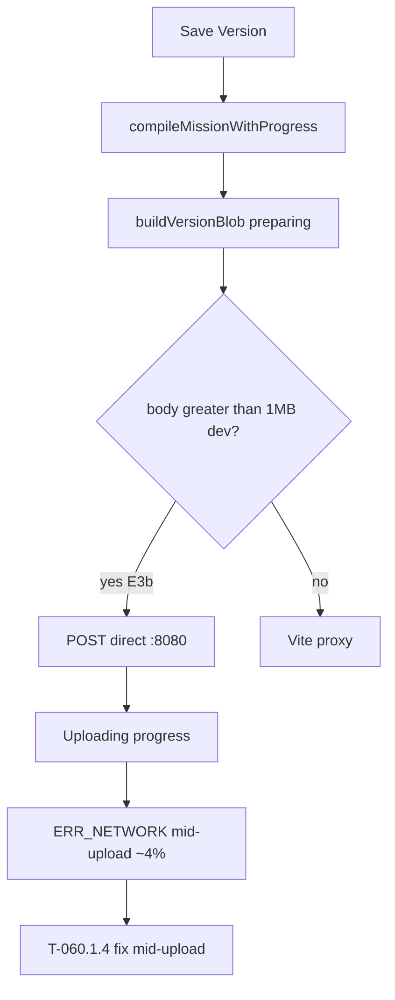

# T-060 — Fast load + save at scale (hydrate gate + progress UX + API body limit)

**Status:** **T-060 + T-060.1 + T-060.1.1 + T-060.1.2 + T-060.1.3 + T-060.1.4 code complete** (uncommitted). Load partial pass @ ~360k. Save mid-upload @ ~135 MB **FIXED (T-060.1.4)** — the 1 MB global body cap had been reaching the version route (hardened `GlobalBodyLimit` skip + production-like IT; **curl 140 MB → 201**). See [t060_1_scale_load_save_completion.md](t060_1_scale_load_save_completion.md) §T-060.1.4. **Tag T-060** after the user confirms browser Save → **201** (restart `make api` — the failing instance was stale).
**Implementation note:** the 256 MB cap is **route-specific middleware** on the versions POST
(`internal/middleware/bodylimit.go` `BodyLimit`), with `GlobalBodyLimit` opting that route out of the
1 MB global cap — a route-level `MaxBytesReader` can't loosen a global one wrapped first. Load
progress was **indeterminate** in T-060 code; **T-060.1** added determinate download/apply/local phases;
**T-060.1.1** added **`restoring`** phase (rAF slot-count poll + `yieldToUi`). `compileMissionWithProgress`
is added alongside the sync `compileMission` (export still uses the sync one).
**Git tag on ship:** T-060 (single commit: T-060 + T-060.1 + T-060.1.1 + T-060.1.2 + T-060.1.3 + **T-060.1.4**)
**Authority:** [MC ROADMAP](ROADMAP.md) §Map performance · [agent_execution.md](agent_execution.md) §ACTIVE SLICE

**Prerequisites:** **T-057–T-059** shipped. **Validated (2026-06):** **360k objects @ 100+ fps** pan; repeat **6k paste** smooth.

**Blocker status @ ~360k (2026-06 manual verify):**

| # | Blocker | Status | Fix |
|---|---------|--------|-----|
| 1 | **IDB replay dead zone / stuck 0%** | ✅ **T-060.1.1** — restoring label within 1–2 s; 0→300k jump acceptable | Incremental counts → **T-062** |
| 2 | **Load snapshot sync cost** | ✅ **T-060.1** — `docToSnapshotWithProgress` | — |
| 3 | **Hydrate outside bulk window** | ✅ **T-060.1** — `endBulkSync` after hydrate | — |
| 4 | **Save instant proxy drop @ 0%** | ✅ **T-060.1.2 E3b** | Auto direct `:8080` in dev |
| 5 | **Save mid-upload ERR_NETWORK @ ~4% / ~135 MB** | ✅ **T-060.1.4** | 1 MB global cap had reached the version route — hardened `isMissionVersionPOST` skip + production-like IT; curl 140 MB → 201 |
| ~~5~~ | ~~**API body limit 1 MB**~~ | ✅ **T-060** | — |
| ~~6~~ | ~~**Save compile hang**~~ | ✅ **T-060** (`compileMissionWithProgress`) | — |

---

## Goal

Make **load** and **Save Version** work at scale: visible **progress bars**, faster boot/save path, and **server accepts large mission version payloads** (path to **1M** objects).

**North-star targets (ideal):**

| Operation | Entity scale | Target |
|-----------|--------------|--------|
| **Open editor** | **1M** slots | **≤10 s** + progress bar |
| **Save Version** | **1M** slots | **≤10 s** + progress bar; **POST succeeds** (not 1 MB capped) |

---

## Acceptance (T-060 — minimum ship)

### Backend — mission version body limit (required for save @ scale)

- **`POST /api/v1/missions/:id/versions`** accepts compiled payloads **>> 1 MB** (see locked limit below).
- Other JSON routes **keep** the **1 MB** default (DoS protection unchanged).
- When payload exceeds the mission-version cap: **413** with JSON `{"error": "payload too large (max … MB)"}` — not a silent connection error.
- `CreateVersion` unchanged contract: `{ semver, payload, editor_notes }` → `201` + version row; `409` duplicate semver.
- `make test-it` still passes; add/adjust integration test for raised limit on version route (small payload smoke; optional comment documenting scale limit).

### Frontend — load

- **10k+** slots: **loading overlay + progress bar** on first paint.
- **bindings** coalesces IndexedDB replay → **one** `docToSnapshot` flush.
- `hydrateMissionDoc` wrapped in bulk coalesce.
- Optional: defer `LeftSidebar` until `docReady`.
- Pan **≥55 fps** after load (regression).

### Frontend — save

- **Save Version** progress bar: `Compiling…` → `Uploading…`.
- Chunked/yielding compile at **50k+** (tab stays responsive).
- **Surface API errors:** 413 body-too-large, 409 semver, backend `error` string — never generic-only when server sent a message.
- **360k Save Version** → **201** (with raised API limit + compile completing).

### Engineering

- `cd frontend && npm run build && npm run lint` clean.
- Go API builds; `make test-it` if DB available.

**Stretch:** **360k** load **≤5 s**; **1M** **≤10 s** (may need T-062/T-066 worker compile).

---

## Root cause — save (updated chain)

Evidence:
- [`useMissionEditor.ts`](../../frontend/src/features/mission-creator/hooks/useMissionEditor.ts): E3b `versionUploadBaseURL`, Blob POST
- [`compiler/compile.ts`](../../frontend/src/features/mission-creator/compiler/compile.ts): `buildVersionBlob`
- [`internal/middleware/bodylimit.go`](../../../internal/middleware/bodylimit.go): 256 MB route cap

---

## Locked decisions

| Decision | Choice |
|----------|--------|
| **Mission version body limit** | **256 MB** default for `POST /missions/:id/versions` only |
| **Global JSON cap** | **Keep 1 MB** for all other routes |
| **Load phases (execution order)** | restoring 0–15% → download 15–35% → apply 35–55% → local 55–100% |
| **Save phases** | compiling → preparing → uploading |
| **Batch upload** | **Not T-060** — needs T-062 incremental API |
| **≤10 s @ 1M** | Out of scope — **T-062** / **T-066** |

---

## Shipped timings (manual — record on T-060 tag)

| Mission | Load wall time | Save wall time | Notes |
|---------|----------------|----------------|-------|
| ~360k (warm IDB) | ~30 s–1 min | curl 140 MB → **201** in ~1.2 s (server-side); browser pending | Mid-upload reset fixed (T-060.1.4) |

---

## After T-060 (tag after the user's browser Save → 201)

**T-061..T-067:** mission-layer scale. **Eden T-068+.** **T-070+:** terrain base — [`t070_terrain_base_mission_layers.md`](t070_terrain_base_mission_layers.md).

**Authority for acceptance slices:** [`t060_1_scale_load_save_completion.md`](t060_1_scale_load_save_completion.md).

**T-060.1.4 (mid-upload fix) — code complete; browser Save → 201 pending.** Spec/prompt: [`t060_1_scale_load_save_completion.md`](t060_1_scale_load_save_completion.md) §T-060.1.4.
