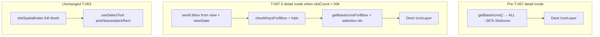

# T-067 — Spatial chunks / lazy regions (mission layer scale)

**Status:** **Spec ready — T-067.0 not started** (code pending). **This is the ACTIVE slice** — implement before Eden T-068+. Phased: **T-067.0** viewport cull + bulk-paste patch → **T-067.1** lazy RAM + Y.Doc compile walk.  
**Git tag on ship:** **T-067** (or **T-067.0** + **T-067.1** if split commits)  
**Authority:** [MC ROADMAP](ROADMAP.md) §Map performance · [agent_execution.md](agent_execution.md) §ACTIVE SLICE · [t066_worker_compile.md](t066_worker_compile.md) · [t063_spatial_index.md](t063_spatial_index.md) · [t110_terrain_base_mission_layers.md](t110_terrain_base_mission_layers.md)

**Prerequisites:** T-066 shipped (`53bc2a8`). Repro mission: `70a36667-612f-40c5-ad56-3fb8e0613a17` (~367k slots).

**Agent roles (locked):** **Cursor** authors and syncs all documentation. **Claude Code reads this spec and implements code only** — return verify output to Cursor; do **not** edit docs.

---

## In one sentence

**Partition the mission map into fixed world grid chunks so Deck only draws visible slots (plus selection), bulk paste stops full ~367k snapshot rebuilds, and (T-067.1) cold chunks can leave RAM on the path to 1M–10M entities.**

---

## Problem (post-T-066)

T-057–T-066 optimized pan/zoom, pick, outliner, cluster LOD, and worker compile @ ~367k. The stack still treats the mission as **monolithic in memory**:

| Layer | Today | @ 1M impact |
|-------|-------|-------------|
| `slotsById` | Every slot as a JS object | Heap blow-up |
| `slotIconCache` dense array | ALL icons | GPU attribute buffer grows linearly |
| Detail `IconLayer` | `getBaseIcons()` → all ~367k rings @ default zoom | Unsustainable |
| Bulk paste (`pasteSlots`) | `incPatchPlan`: `added.length !== 1` → **full `docToSnapshot`** | Multi-second freeze |
| Save | `pickMapSnapshot` → worker walks **all** slots | Linear postMessage + compile |

**Existing “chunks” are I/O-only (not geographic):** T-062.1 IDB `PERSIST_CHUNK_SIZE = 5000` batches slots in **iteration order** for restore/yield — not viewport bins. Do **not** conflate with T-067.

**T-063 spatial index** (rbush pick/marquee) stays **full-world** — T-067 cull affects **render** only in T-067.0, not pick.

---

## Goal (phased)

### T-067.0 — Viewport cull + bulk-paste incremental patch (implement first)

1. **512m world grid** over terrain bounds (`coords/terrains.ts`: Everon 12800×12800 m → 25×25 bins).
2. **Detail IconLayer** feeds only icons in **visible chunks + halo + current selection** when `slotCount > CHUNK_CULL_THRESHOLD`.
3. **`slot-add-bulk`** incremental patch for `pasteSlots` (≤10k slots per txn) — O(k) store + cache updates, no full snapshot.

**No regression @ 367k repro:** pan ~160 fps @ zoom -2, Save **201**, pick/marquee/drag/cluster unchanged.

### T-067.1 — Lazy chunk residency (after T-067.0 ships)

1. Evict cold chunks from `slotsById` + caches; keep authoritative data in **Y.Doc**.
2. Load chunk slots on viewport enter (yield via `yieldToUi`).
3. Save/Export compile walks **`md.entities.slots`** in worker without full store materialization.
4. Optional IDB v3 spatial chunk keys (migration from v2 iteration-order chunks).

**Stretch:** ≤10 s compile+prepare @ 1M ([`t066_worker_compile.md`](t066_worker_compile.md) §Stretch).

---

## Out of scope

- T-110 terrain base (millions of read-mostly props — separate layer)
- Eden **T-068+** (after T-067 scale milestones)
- T-061.1 typed-array IconLayer (deferred mega-opt)
- Replacing Y.Doc / ORBAT / Save POST contract
- Moving `viewState` into Zustand
- Changing T-065 cluster band (`ZOOM_CLUSTER_MAX = -4`) or T-063 pick path in T-067.0
- Registry worker, server Enfusion compile (T-072)

---

## Locked decisions (T-067.0)

| Decision | Choice |
|----------|--------|
| Chunk size | **512m** world meters |
| Grid | `chunkKey = cy * cols + cx`; clamp to terrain `[0, width) × [0, height)` |
| Halo | **1** adjacent chunk ring around viewport bbox |
| Cull gate | Viewport cull when `slotCount > CHUNK_CULL_THRESHOLD` (**50_000**); below → existing `getBaseIcons()` all-icons path |
| Selection | **Always render selected slot ids** even if off-screen (never “vanish” when panned away) |
| Pick / marquee | **Unchanged** — full `slotSpatialIndex` rbush; cull is render-only |
| Cluster mode | **Unchanged** — T-065; `useIconLayer` selection-only branch when `!detail` |
| Bulk paste cap | **10_000** slots (`REMOVE_PATCH_CAP` in `incPatchPlan.ts`) |
| `viewState` | Local to `TacticalMap` / `useOrthographicView` — pass world bbox into `useIconLayer` as props |
| Doc ownership | **Cursor only** — Claude Code does not edit markdown |

---

## Architecture (T-067.0)



---

## Implementation — T-067.0 (file table)

| File | Action | Role |
|------|--------|------|
| **NEW** [`frontend/src/features/tactical-map/state/spatialChunks.ts`](../../frontend/src/features/tactical-map/state/spatialChunks.ts) | Create | `CHUNK_SIZE_M`, `CHUNK_HALO`, `chunkColRow`, `chunkKey`, `chunkKeysForBbox`, `terrainChunkCols/Rows` |
| **NEW** [`frontend/src/features/tactical-map/state/viewportBbox.ts`](../../frontend/src/features/tactical-map/state/viewportBbox.ts) | Create | `worldBboxFromViewport(view, viewState, width, height)`; `expandedBboxForHalo(bbox, terrain, halo)` |
| [`frontend/src/features/tactical-map/state/constants.ts`](../../frontend/src/features/tactical-map/state/constants.ts) | Modify | Export `CHUNK_CULL_THRESHOLD = 50_000` |
| [`frontend/src/features/tactical-map/state/slotIconCache.ts`](../../frontend/src/features/tactical-map/state/slotIconCache.ts) | Modify | `id → chunkKey` membership; **`getBaseIconsForBbox(bbox, extraIds)`**; maintain membership on rebuild/append/remove/patch |
| [`frontend/src/features/tactical-map/state/incPatchPlan.ts`](../../frontend/src/features/tactical-map/state/incPatchPlan.ts) | Modify | Add `slot-add-bulk` plan; `added.length > 1 && <= REMOVE_PATCH_CAP` |
| [`frontend/src/features/tactical-map/state/bindings.ts`](../../frontend/src/features/tactical-map/state/bindings.ts) | Modify | `applyPlan` case `slot-add-bulk` |
| [`frontend/src/features/tactical-map/state/useMapStore.ts`](../../frontend/src/features/tactical-map/state/useMapStore.ts) | Modify | **`_patchAddSlotsBulk(slots, squads, layers)`** — in-place inserts, O(k), `slotIconCache.append` once |
| [`frontend/src/features/tactical-map/layers/useIconLayer.ts`](../../frontend/src/features/tactical-map/layers/useIconLayer.ts) | Modify | Props: `cullBbox`; branch on `CHUNK_CULL_THRESHOLD` |
| [`frontend/src/features/tactical-map/TacticalMap.tsx`](../../frontend/src/features/tactical-map/TacticalMap.tsx) | Modify | Compute `cullBbox` from container + `view` + `viewState`; pass to `useIconLayer` |

**Do NOT modify in T-067.0:** `compiler/*`, `useMissionEditor.ts`, `slotChunkStore.ts`, `ydoc.ts`, `slotClusterIndex.ts` (unless append path requires chunk membership sync — prefer icon cache owns membership).

---

## T-067.0 — incremental patch detail

### `incPatchPlan.ts` — `slot-add-bulk`

When `slotsStructural` and only adds (no removes), `added.length > 1 && added.length <= REMOVE_PATCH_CAP`:

```ts
{ kind: 'slot-add-bulk', slots: Slot[], squads: Record<ID, Squad>, layers: Record<ID, EditorLayer> }
```

Gather each added slot via `e.slots.get(id)?.toJSON()`. Preserve existing single `slot-add` path (`added.length === 1`).

### `useMapStore._patchAddSlotsBulk`

Mirror `_patchAddSlot` but loop k slots:

- In-place `slotsById[id] = slot` (no O(n) spread)
- `slotCount += k`, `slotsRevision++`
- Merge squad/layer patches
- `slotIconCache.append(slots, selection)` once
- `iconCacheVersion` bump

Undo of bulk paste should classify as `slot-remove` (already incremental when ids ≤ cap).

---

## T-067.1 — design notes (spec only; implement after .0 ships)

| Area | Approach |
|------|----------|
| Resident set | Viewport+halo chunks + chunks containing selection + chunks under active drag |
| Eviction | LRU cap (e.g. max 64 resident chunks); remove from `slotsById` + chunk caches |
| Load | On viewport enter → read slot ids in chunk from Y.Doc, `_patchAddSlotsBulk`-style hydrate |
| Save | Worker iterates `md.entities.slots` keys in chunks with yield — avoid full `pickMapSnapshot` materialization |
| IDB | Optional v3: spatial chunk keys instead of iteration-order 5k batches |

---

## Acceptance — T-067.0 (ship gate)

Repro: `70a36667-612f-40c5-ad56-3fb8e0613a17` (~367k). Stack: `make api` + `make web`, dev-login `mission_maker`.

| Check | Bar | Status |
|-------|-----|--------|
| Pan/zoom @ zoom -2 (detail) | No regression (~160 fps target) | Pending |
| Save Version | **201** | Pending |
| Ctrl+C/V 6k paste loop | No multi-second freeze; undo works | Pending |
| Click / marquee / dbl-click Attributes | Unchanged (T-063) | Pending |
| Drag-move + undo | Unchanged (T-061) | Pending |
| Cluster drill-in @ zoom ≤ -4 | Unchanged (T-065) | Pending |
| Off-screen selected slot | Still visible when selected | Pending |
| `npm run build` + `lint` | Clean | Pending |
| Git tag T-067 (or T-067.0) | Committed | Pending |

---

## Acceptance — T-067.1 (ship gate)

| Check | Bar | Status |
|-------|-----|--------|
| RAM @ 1M (profile) | Resident chunks bounded; no full `slotsById` for all slots | Pending |
| Save @ 1M | **201** or documented stretch ≤10 s compile | Pending |
| Pan/zoom with lazy load | No visible pop-in inside halo; yield on chunk load | Pending |
| T-067.0 regression suite | All .0 checks still pass | Pending |

---

## After T-067 ship

- **Eden T-068+** (asset registry, markers, vehicles, ORBAT authoring)
- **T-110** terrain base (extends T-067 chunk binning for millions of map props)

---

## Documentation sync (Cursor)

On T-067.0 code ship: `CLAUDE.md` §Status, `agent_execution.md`, `ROADMAP.md`, `feature_inventory.md` (PERF-CHUNK-001), `TAGS.md`, `docs/AGENT_COMMIT_CHECKLIST.md`, `frontend/docs/pages/mission-editor.md`, spec footers.

This doc-only prep commit syncs authority docs to **spec ready** — no §Status bump until code lands.

---

## Claude Code prompt — T-067.0 (copy-paste)

**Read this file first.** Implement **T-067.0 only**. Do **not** edit any documentation.

```
# T-067.0 — Spatial chunks: viewport-culled render + bulk-paste incremental patch

Authority: Design_Docs/Mission_Creator_Architecture/t067_spatial_chunks.md
Prerequisites: T-066 shipped (53bc2a8). Repro mission: 70a36667-612f-40c5-ad56-3fb8e0613a17 (~367k).

## Goal
Only feed Deck slot icons in visible map chunks (plus selection). Stop bulk paste from triggering full ~367k snapshot rebuild.

## Locked decisions
- CHUNK_SIZE_M = 512, CHUNK_HALO = 1
- CHUNK_CULL_THRESHOLD = 50_000 (below → getBaseIcons() all-icons path)
- Pick/marquee: UNCHANGED (full slotSpatialIndex rbush)
- Cluster mode: UNCHANGED (T-065 ZOOM_CLUSTER_MAX = -4)
- Bulk paste: slot-add-bulk when added.length > 1 && <= 10_000 (REMOVE_PATCH_CAP)
- viewState is in TacticalMap/useOrthographicView — NOT Zustand; pass cullBbox into useIconLayer

## Tasks
1. NEW state/spatialChunks.ts — grid math (see spec file table)
2. NEW state/viewportBbox.ts — worldBboxFromViewport + halo expansion
3. MODIFY state/constants.ts — CHUNK_CULL_THRESHOLD
4. MODIFY state/slotIconCache.ts — chunk membership; getBaseIconsForBbox(bbox, extraIds); always include selection ids
5. MODIFY state/incPatchPlan.ts — slot-add-bulk plan
6. MODIFY state/bindings.ts — applyPlan slot-add-bulk
7. MODIFY state/useMapStore.ts — _patchAddSlotsBulk
8. MODIFY layers/useIconLayer.ts — cullBbox prop + threshold branch
9. MODIFY TacticalMap.tsx — compute cullBbox, pass to useIconLayer

## Out of scope
T-067.1 lazy RAM, IDB v3, compiler/save changes, slotClusterIndex changes, Y.Doc/schema/backend, moving viewState to store.

## Verify
cd frontend && npm run build && npm run lint

Manual @ 70a36667-…:
- Pan/zoom @ -2 — no fps regression
- 6k paste loop — no freeze; undo OK
- Save Version → 201
- Click, marquee, dbl-click, drag, cluster drill-in unchanged
- Selected off-screen slot still visible

Return file list + build/lint output + manual notes to Cursor. DO NOT update docs.
```

---

## Claude Code prompt archive — T-067.1 (after .0 ships)

Do not run until T-067.0 is committed and verified. See §T-067.1 design notes in this file; Cursor will publish an updated prompt when .0 ships.
