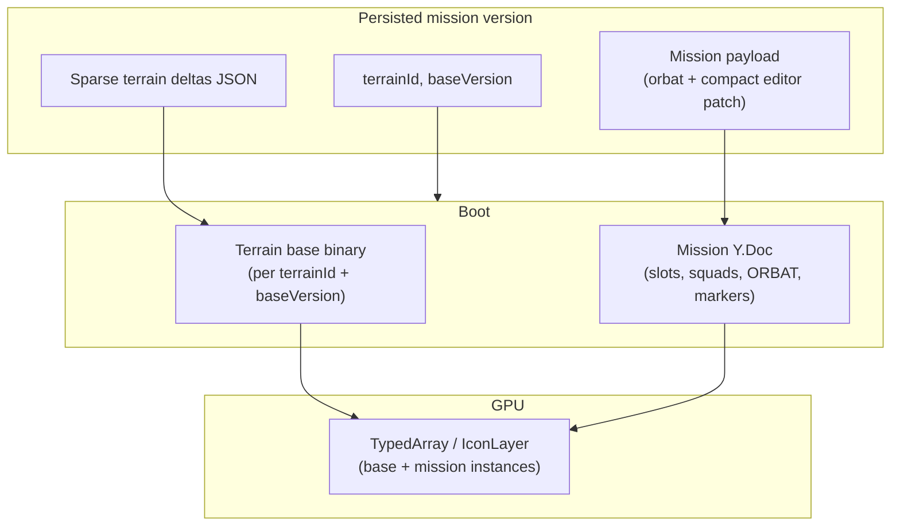

# T-070+ — Terrain base + mission layers (future architecture)

**Status:** **future / not started** — do **not** implement before **T-061..T-067** + Eden **T-068+** unless product explicitly reprioritizes. (T-060 shipped `b1fd25a`.)
**Authority:** [ROADMAP.md](ROADMAP.md) §Map performance · [engineering_plan.md](engineering_plan.md)
**Relates to:** External “Base + Delta / event sourcing” proposal (2026-06) — **adopt the good parts here**, not as a rewrite of the current Y.Doc mission model.

---

## Why this doc exists

At **10M** scale, saving every object as JSON (current `editor.slots[]` superset) will crash the browser and blow HTTP/DB limits. That was visible @ **360k** (load stringify, save mid-upload reset — **fixed T-060.1.4**, shipped `b1fd25a`).

Two **different** entity classes must not be conflated:

| Layer | Examples | Count | Edit pattern | Current stack |
|-------|----------|-------|--------------|---------------|
| **Terrain / world base** | Trees, rocks, buildings from map file | **Millions** | Mostly read-only; **sparse** user edits (delete prop, move fence) | **Not built** — no binary base asset |
| **Authored mission entities** | ORBAT slots, markers, vehicles, objectives | **Thousands–360k+** (stress) | Dense edits; squads, loadouts, layers | **Built** — Y.Doc `Slot`/`Squad`/… + `compile.ts` |

**T-061..T-067** optimizes the **mission layer** (typed-array render, incremental bindings, spatial index, worker compile).

**T-070+** adds an optional **terrain layer** using base + delta — only when Track A (tiles/DEM/world assets) and product need “edit native map objects at scale.”

---

## Adopt from external proposal (good parts)

| Idea | Adopt? | Where it lands |
|------|--------|----------------|
| Binary **base** loaded into TypedArray on boot | **Yes** (terrain only) | T-070+ after hosted world assets |
| Save/load **sparse deltas** not full world JSON | **Yes** | Terrain deltas + T-062 mission patches |
| **Server-side compile** to Enfusion on save | **Yes** (stretch) | Backend worker after T-066 client compile proven |
| **Visual version timeline** | **Partial** | UI on existing `MissionVersion` semver rows; optional delta replay for terrain |
| **No manual Export as primary path** | **Already aligned** | Save Version → POST; Export = download only |
| Replace Y.Doc / ORBAT with deltas only | **No** | Mission layer keeps normalized entities + compiler |
| Float32Array alone = “one object” | **No** | Need class/id, transform stride, flags — asset pipeline required |
| Git scrub every edit on 10M base | **Defer** | Expensive replay; use version snapshots + checkpoints |

---

## Dual-layer model (target)

### Terrain base (T-070+)

- **Source:** Extracted Enfusion/world asset per terrain (Everon, Arland), versioned, CDN-hosted `ArrayBuffer`.
- **Layout:** Fixed-stride TypedArray or chunked spatial bins (extends **T-067** spatial chunks).
- **Load:** mmap-style fetch → GPU buffer in **milliseconds**; no JSON parse.
- **Edit:** Sparse delta log, e.g. `{ op: "hide", baseId: 4500211 }`, `{ op: "add", class: "...", transform: [...] }`.
- **Save:** Only **deltas + baseVersion** — not 10M objects.

### Mission layer (T-061..T-062 — current program)

- Keep **Y.Doc** normalized model ([`schema.ts`](../../frontend/src/features/tactical-map/state/schema.ts)).
- **T-061.0.1 ✅ shipped:** Slot-position fast path in `bindings.ts` + `slotIconCache` (drag @ 360k — good enough).
- **T-062:** Interactive incremental `bindings.ts` — patch Zustand O(k) on classified everyday edits @ 360k (**shipped**). **T-062.2:** editor session / alt-tab resilience (**shipped**). **T-062.1:** chunked IDB load (**shipped**). **T-062.1.1** ✅ Save orbat dedup. **T-063** ✅ spatial index. **Active: T-064..T-067**.
- **T-066:** Worker `compileMission` for export/save assembly.
- **Save payload:** `orbat[]` (backend contract) + compact `editor` patch or full block for missions under ~50k; avoid duplicating orbat in editor block long-term.

### Version control UX (T-071+ stretch)

- **Near-term:** Immutable `MissionVersion` semver rows (already shipped) + diff summary in UI.
- **Stretch:** Scrub bar replays **terrain deltas** + loads **mission snapshot** at checkpoint — not full 10M replay every scrub.

### Server compile (T-072+ stretch)

- On `POST /missions/:id/versions`, optional worker:
  1. Resolve `terrainId` + `baseVersion` + terrain deltas
  2. Merge mission `orbat` / entities
  3. Emit Enfusion-compatible mission JSON for game server
- **Prerequisite:** Verified Enfusion export schema (engineering_plan §0 prerequisites).

---

## Phased tags (future — after T-067)

| Tag | Focus | Depends on |
|-----|-------|------------|
| **T-068+** | Eden parity (locked before this) | gap_analysis P0–P2 |
| **T-070** | Terrain base asset pipeline + read-only render | Track A tiles/DEM, hosted binaries |
| **T-071** | Terrain delta CRUD + sparse save | T-070 |
| **T-072** | Server compile worker (Enfusion export) | T-066, export schema |
| **T-073** | Version timeline UI (semver + optional delta scrub) | T-071 |

**Do not renumber T-061..T-067.** T-070+ is explicitly **after** Eden T-068+ and scale milestones unless leadership reprioritizes.

---

## Explicit non-goals (T-070+)

- Replacing ORBAT / Event Hub `parseOrbatTemplate` contract
- Storing 10M full JSON objects in Postgres `json_payload`
- Second undo system parallel to Y.UndoManager without a source-of-truth decision
- Implementing before **T-064..T-067** scale milestones + Eden **T-068+**

---

## Relationship to current pain @ 360k

| Symptom | Fix now | Fix long-term |
|---------|---------|---------------|
| Save `ERR_NETWORK` | **T-060.1.2** pre-built POST + **T-060.1.3** diagnosed | **T-060.1.4** middleware fix; T-062 patch payload; T-066 worker |
| Load 0→300k IDB jump | T-060.1.1 ✅ legacy v1 | **T-062.1** ✅ v2 chunked restore |
| 360k authored **slots** | Mission layer scale program | Not terrain base (unless those slots *are* terrain props — product decision) |

If the 360k test mission is **authored units**, stay on mission-layer fixes. If product later needs **millions of editable props**, add terrain base under T-070+.

---

## Documentation sync

When T-070 work starts, update: [ROADMAP.md](ROADMAP.md), [CLAUDE.md](../../CLAUDE.md) §Status, [TAGS.md](../../docs/TAGS.md), [engineering_plan.md](engineering_plan.md).
