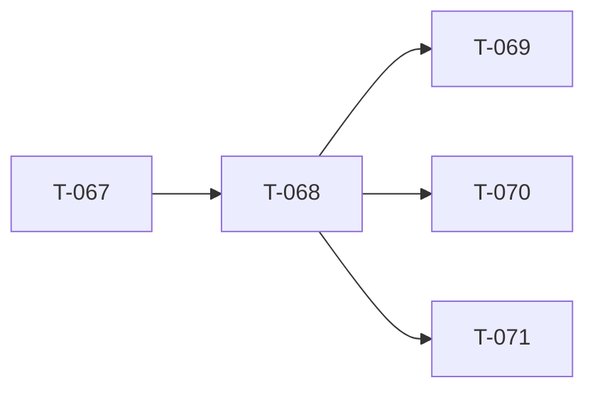

<!-- AUTO-GENERATED by ./scripts/ticket sync — DO NOT EDIT -->

# Ticket Lead Dashboard

## Running / Review

## Ready

## Next queued (top 10)

- **T-068** (680) — Asset registry + palette [queued] — Replace mock catalog with registry-backed Factions tree.
- **T-069** (690) — Markers on map [queued] — Place and edit map markers with registry-backed types.
- **T-070** (700) — Vehicles placeable [queued] — Drag vehicles from palette onto map with crew hooks.
- **T-071** (710) — ORBAT Manager modal [queued] — Remove duplicate ORBAT tree from left sidebar; open ORBAT Manager modal for all-side faction/squad/slot authoring, slotting-screen order, standardizations, logos, and arsenal.
- **T-072** (720) — Ctrl multi-place [queued] — Hold Ctrl to place multiple copies without re-selecting asset.
- **T-073** (730) — Shift + map rotation [queued] — Shift-drag and map rotation widget for placed entities.
- **T-074** (740) — Faction submode / catalog filter [queued] — Faction submode tabs and catalog filtering in asset browser.
- **T-075** (750) — Spacebar flyTo vs widget [queued] — Spacebar centers selection; resolve flyTo vs transform widget conflict.
- **T-076** (760) — Vehicle crew UI [queued] — Crew panel and boarding UI for placed vehicles.
- **T-077** (770) — Alt + empty vehicle [queued] — Alt-click to enter empty vehicle placement mode.

## Dependency graph (scoped)

